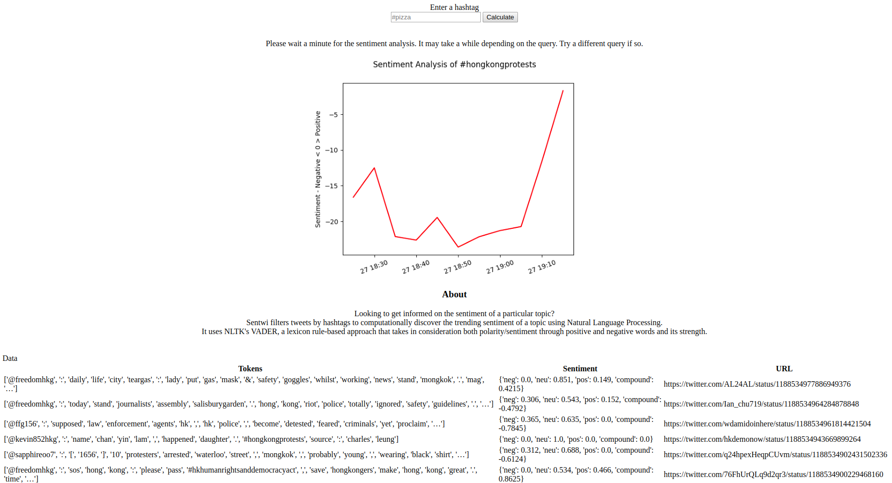

# Sentwi - Sentiment Analysis WebApp
App - https://aqueous-meadow-96789.herokuapp.com/  
Uses the Twitter API to collect the last 2500 tweets including retweets (unless rate limited) and sums the sentiment scores by an interval based on date/time of tweets  
Flask web framework for serving the website with logic and views

Example

